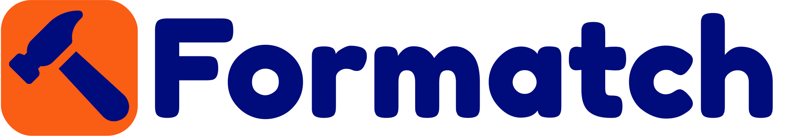
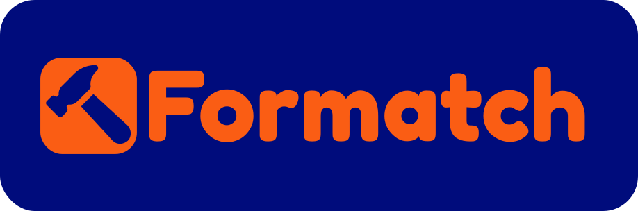

<!-- #  -->

 
 

Conecta você a um profissional da área de construção civil, e ainda te mantém informado sobre novidades do setor.

 
 

<a href="https://play.google.com/store/apps/details?id=com.mateusfg7.formatch" target="_blank">
  

</a>
 
 
 

# O Projeto

## Introdução

Este projeto esta sendo desenvolvido para o **Projeto de Inovação** do curso **Técnico em Edificações**, pela instituição _SESI SENAI CFP Celso Charuri_, em Pará de Minas.

## Tecnologias usadas

- Typescript
- React
- React-Native
- Expo
- Native-Base
- Phosphor Icons

## Interface

A interface esta sendo desenvolvida usando o Figma:
https://www.figma.com/file/NkIXXfyFD3qOzn3R4Btdbj/Formatch?node-id=4%3A3&t=QShQuWiOeJ3ijLqU-1

 
 

---

 
 

